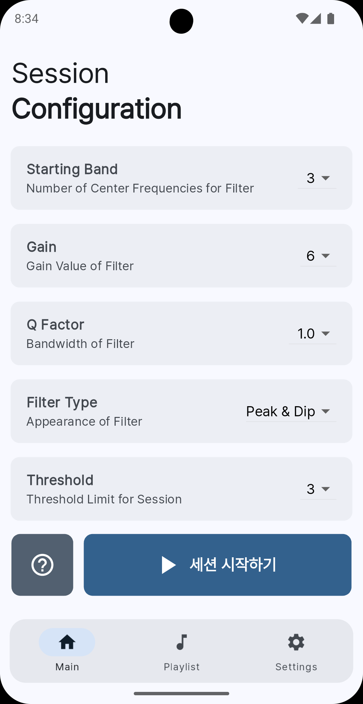
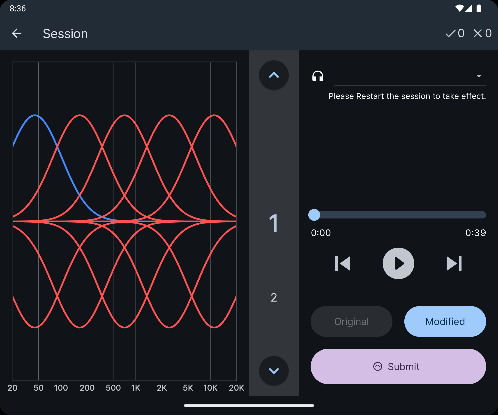
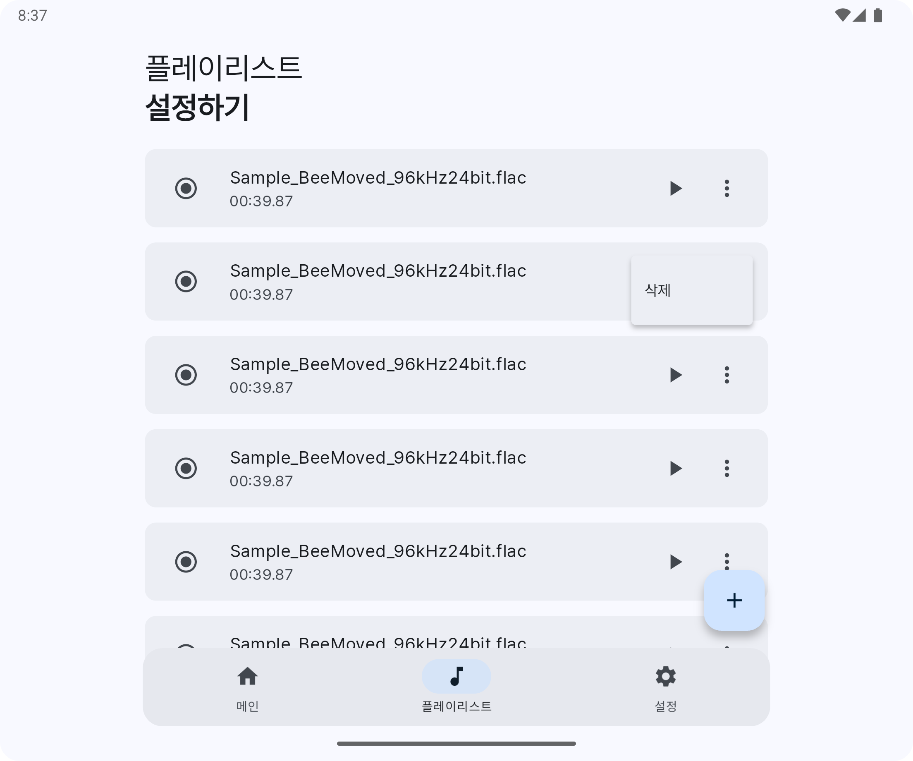
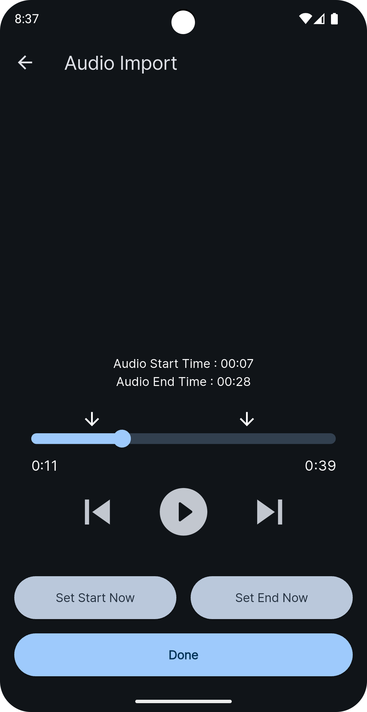

-----------------

eqTrainer is an open-source training application for 'Critical Listening', built with Flutter.

[][RELEASE]

## Features

Inspired by Harman International's free desktop software [How To Listen][H2LLink], eqTrainer aims to bring the iconic **Band Identification Task** to multiple devices, including mobile.

The **Playlist Feature** and **Built-in Audio Clip Editor** make managing music for your training sessions a breeze.

With **Multilingual Support**, anyone can train their listening skills. The beautiful design (at least to my eyes) with **Dark Mode** adds to its charm.

## Screenshots

  

## Supported Platforms

| Platform | Minimum Version | Note                                                                                     |
|----------|-----------------|------------------------------------------------------------------------------------------|
| Windows  | Vista           | Works with WASAPI   **Audio Editor is not available at the moment.**                 |
| MacOS    | 11 Big Sur      | Supports Intel & Apple Silicon as Universal App                                          |
| Linux    | -               | Works with ALSA, Jack, PulseAudio   **Audio Editor is not available at the moment.** |
| Android  | 7.0             | Works with OpenSL ES & AAudio                                                            |
| iOS      | 12.1            | Manual Sideload Required.   Use [Sideloadly][SIDELOADLY] or [Altstore][ALTSTORE].    |

## Download

| Windows                 | MacOS                    | Linux          | Android                 | iOS            |
|-------------------------|--------------------------|----------------|-------------------------|----------------|
| [Portable ZIP][RELEASE] | [Universal DMG][RELEASE] | [DEB][RELEASE] | [Play Store][PLAYSTORE] | [IPA][RELEASE] |
|                         |                          |                | [APK][RELEASE]          |                |

## FAQ & Troubleshooting

Please refer to [FAQ Wiki Page](https://github.com/potatosalad775/eqTrainer/wiki/FAQ).

## Contributing

### Localization

eqTrainer is built with Localization in mind, and you can easily contribute to this project by translating it!

If you want to translate this project, please refer to [Localization Wiki page](https://github.com/potatosalad775/eqTrainer/wiki/Localization).

### Donation

If you like this project, please consider donating!

 
[][PAYPAL]

[H2LLink]: http://harmanhowtolisten.blogspot.com/ "How to Listen"
[RELEASE]: https://github.com/potatosalad775/eqTrainer/releases/latest
[PLAYSTORE]: https://play.google.com/store/apps/details?id=kr.potatosalad775.eq_trainer
[PAYPAL]: https://paypal.me/potatosalad775/
[SIDELOADLY]: https://sideloadly.io/
[ALTSTORE]: https://altstore.io/