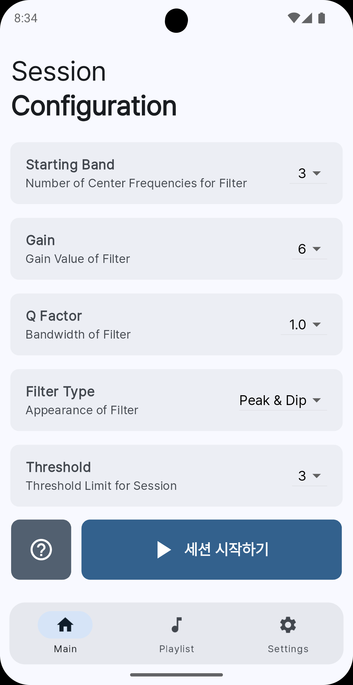
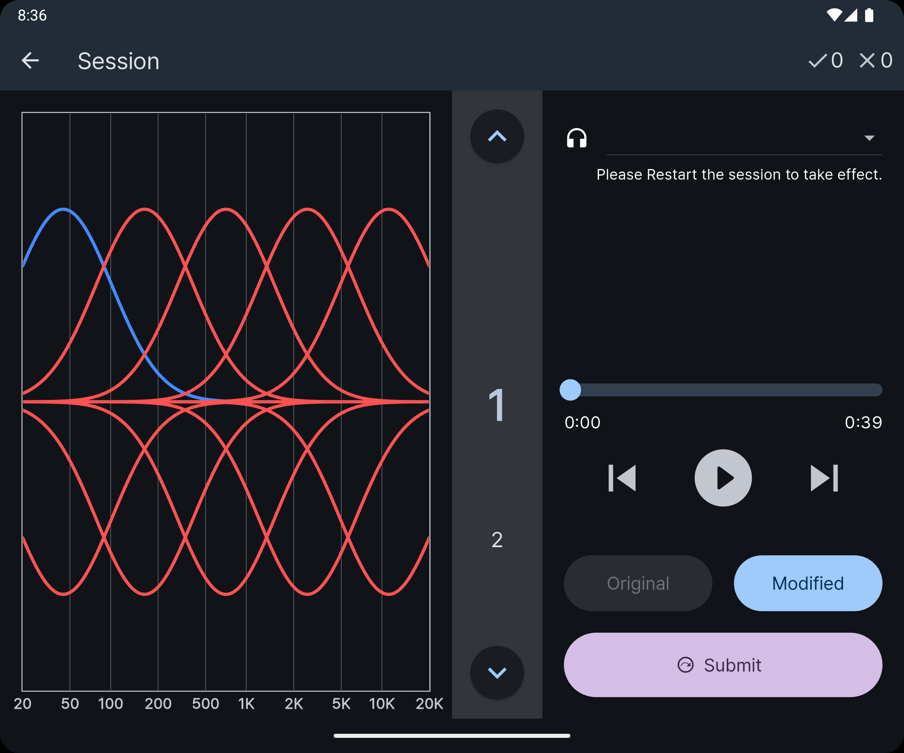
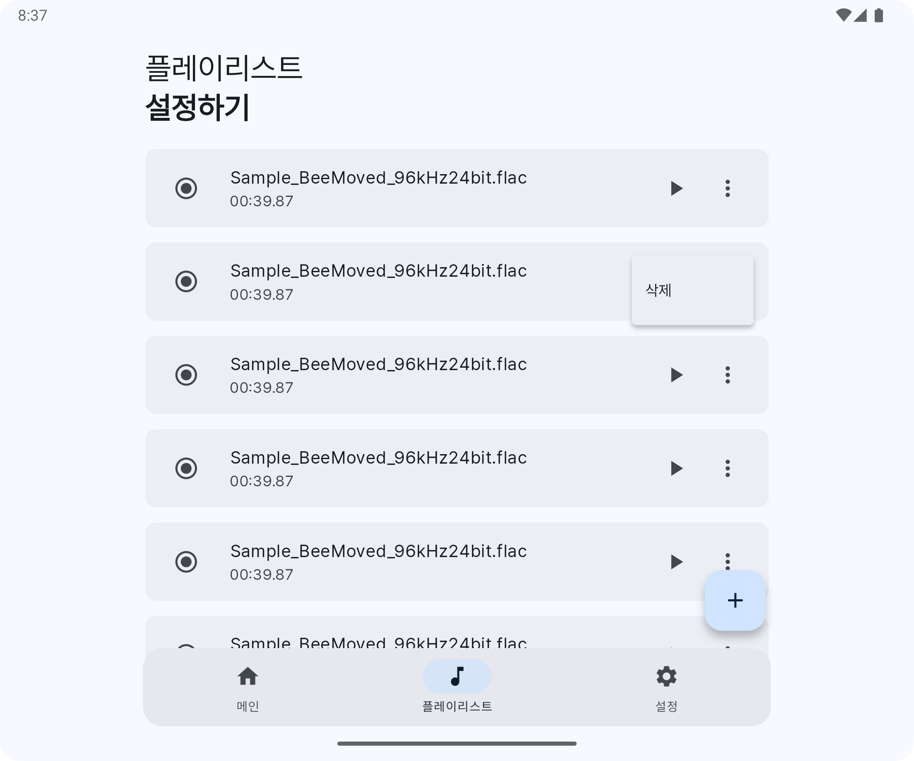
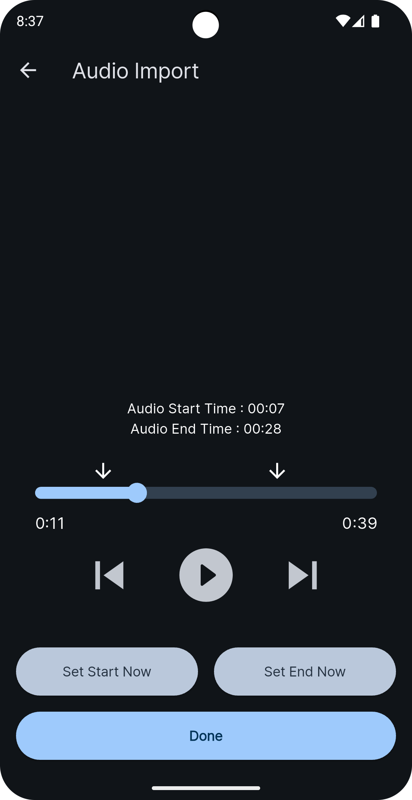

<div align="center">


-----------------

eqTrainer is an open-source training application for 'Critical Listening', built with Flutter.

[](https://play.google.com/store/apps/details?id=kr.potatosalad775.eq_trainer&pcampaignid=pcampaignidMKT-Other-global-all-co-prtnr-py-PartBadge-Mar2515-1)
[][RELEASE]

</div>

## Features

Inspired by Harman International's free desktop software [How To Listen][H2LLink], eqTrainer aims to bring the iconic **Band Identification Task** to multiple devices, including mobile.

The **Playlist Feature** and **Built-in Audio Clip Editor** make managing music for your training sessions a breeze.

With **Multilingual Support**, anyone can train their listening skills. The beautiful design (at least to my eyes) with **Dark Mode** adds to its charm.

## Screenshots

<div align="center">
  
[](./.github/screenshot/Screenshot_1.png)
[](./.github/screenshot/Screenshot_2.png)
[](./.github/screenshot/Screenshot_3.png)
[](./.github/screenshot/Screenshot_4.png)

</div>

## Supported Platforms
    
| Platform | Minimum Version | Note                                                                                              |
|----------|-----------------|---------------------------------------------------------------------------------------------------|
| Windows  | 10+             | Works with WASAPI <br/> <sub>*For devices older than Windows 10, please use [v2.3.0][VERSION_2.3.0]*</sub>                             |
| MacOS    | 11 Big Sur      | Supports Intel & Apple Silicon as Universal App                                                                         |
| Linux    | -               | Works with ALSA, Jack, PulseAudio <br/> <sub>*GStreamer 1.0+ required for audio format conversion.*</sub>               |
| Android  | 7.0             | Works with OpenSL ES & AAudio                                                                     |
| iOS      | 14.0            | Manual Sideload Required. <br/> Use [Sideloadly][SIDELOADLY] or [Altstore][ALTSTORE].             |

[SIDELOADLY]: https://sideloadly.io/
[ALTSTORE]: https://altstore.io/
[VERSION_2.3.0]: https://github.com/potatosalad775/eqTrainer/releases#release-v2.3.0

> [!IMPORTANT]
> Please note that `GStreamer` is required on Linux for format conversion. While most distros should already have it preinstalled, you can manually install it if needed.
> ```bash
> sudo apt install \
> libgstreamer1.0-dev libgstreamer-plugins-base1.0-dev \
> gstreamer1.0-plugins-good gstreamer1.0-plugins-bad
> ```


## Download
      
| Windows                 | MacOS                    | Linux          | Android                 | iOS            |
|-------------------------|--------------------------|----------------|-------------------------|----------------|
| [Portable ZIP][RELEASE] | [Universal DMG][RELEASE] | [DEB][RELEASE] | [Play Store][PLAYSTORE] | [IPA][RELEASE] |
|                         |                          |                | [APK][RELEASE]          |                |

## FAQ & Troubleshooting

Please refer to [FAQ Wiki Page](https://github.com/potatosalad775/eqTrainer/wiki/FAQ).

> [!WARNING]
> **macOS: "Apple could not verify... / check with the developer" on first launch**
>
> The macOS build isn't notarized yet (no paid Apple Developer account), so
> Gatekeeper blocks it on a fresh download. Removing the quarantine flag
> (`xattr -d com.apple.quarantine`) doesn't reliably fix this on recent macOS
> versions. Instead:
> 1. Try to open `eq_trainer.app` (it'll be blocked) — or right-click it and choose **Open**.
> 2. Go to **System Settings → Privacy & Security**, scroll to the bottom, and click **Open Anyway** next to the eqTrainer message.
> 3. Confirm in the dialog that appears (may require your password / Touch ID).
>
> This only needs to be done once per download.

## Contributing

### Localization

eqTrainer is built with Localization in mind, and you can easily contribute to this project by translating it!

If you want to translate this project, please refer to [Localization Wiki page](https://github.com/potatosalad775/eqTrainer/wiki/Localization).

### Donation

If you like this project, please consider donating!

[](https://ko-fi.com/B0B1N764X) 
[][PAYPAL]

[H2LLink]: http://harmanhowtolisten.blogspot.com/ "How to Listen"
[RELEASE]: https://github.com/potatosalad775/eqTrainer/releases/latest
[PLAYSTORE]: https://play.google.com/store/apps/details?id=kr.potatosalad775.eq_trainer
[PAYPAL]: https://paypal.me/potatosalad775/
